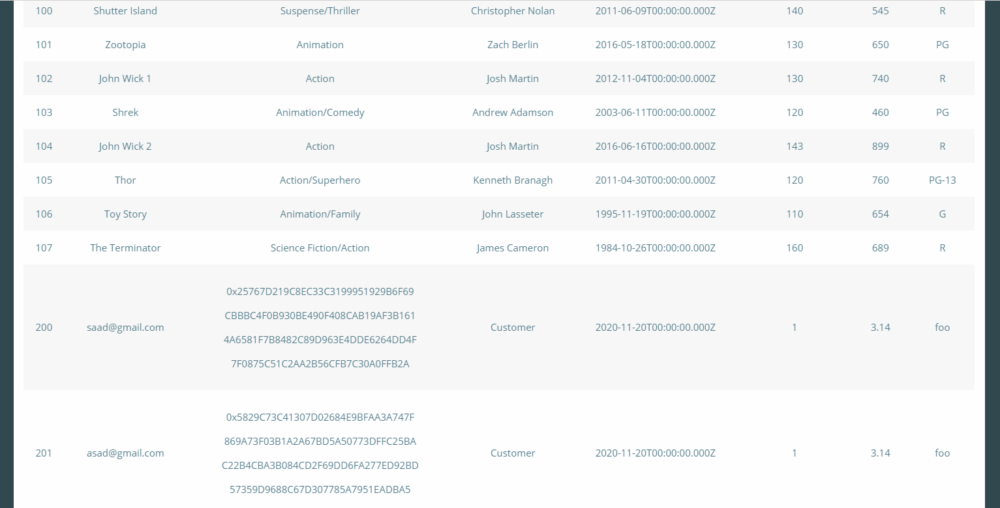

# SQL Injection Demonstration 💉

This is a Node.js/Express.js based application with SQL Server Database, vulnerable to SQLi to demonstrate the SQL Injection attack.

## Getting Started 🔰

### 1. Installation ⬇

* Clone this repo

  ```
  $ git clone git@github.com:AbdulMoizAli/SQL-Injection-Demo.git

  $ cd SQL-Injection-Demo
  ```

* Install the dependencies

  ```
  $ npm install
  ```

### 2. Configuration 🛠

* Connect to the local instance of SQL Server and Execute the `init.sql` script to create and populate the database and tables. You can use SSMS or Azure Data Studio to execute the script.

* Rename the `.env.sample` file to `.env` and configure the node environment variables. Use your SQL Server credentials in the `.env` file.
  
  ```
  DB_USER=Your SQL Server login name
  DB_PASSWORD=Your SQL Server login password
  DB_SERVER=localhost
  DB_NAME=Moviedb
  ```
    
## Usage ⚙

### 1. Start the server 🖥
  
```
$ npm run dev
```
    
Use SQL statements from the `inject.sql` script to demonstrate the SQLi attack. `inject.sql` contains the common flow and 5 **UNION** based SQL statements that are typically used to attack and extract information from the database.
  
### 2. Example 👇

Injecting the following SQL Statement in the user input would retrieve the users information, such as user's Email and Password Hash. Make sure to include a single quote at the start and 2 hyphens at the end of the statement.
  
```
' UNION
  SELECT Id, Email, PasswordHash, [Type], '2020-11-20', 1, 3.14, 'foo'
  FROM Account; --
```
    



